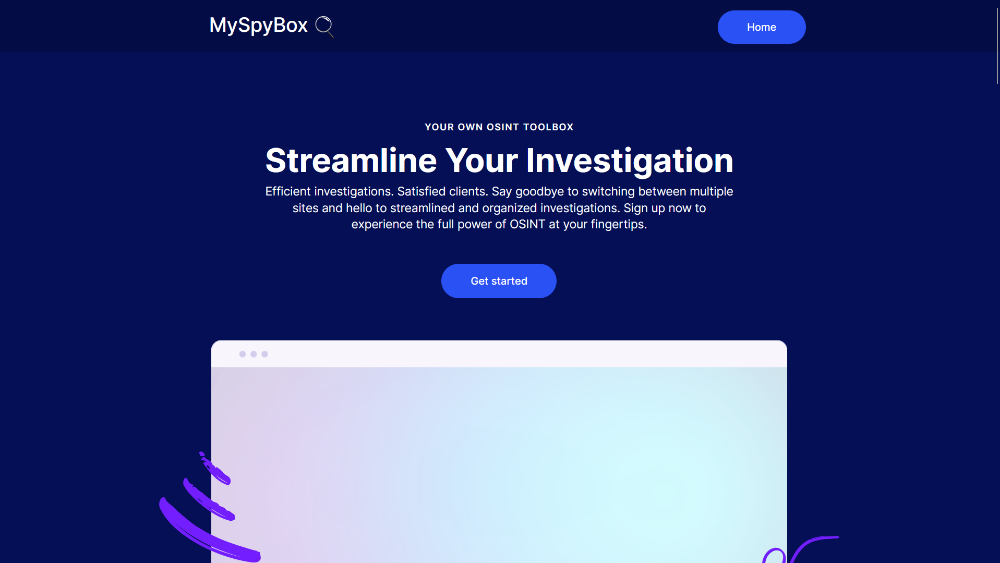
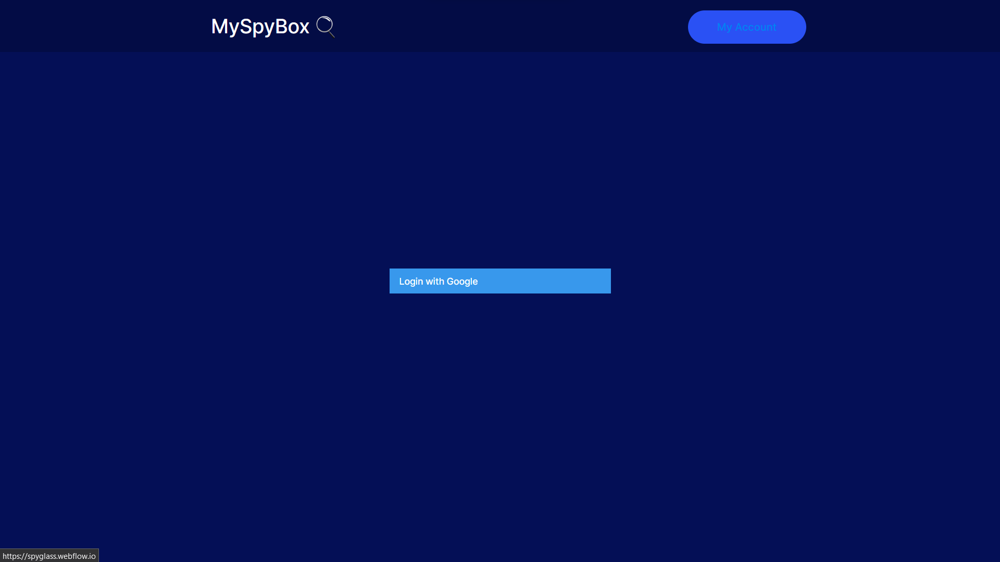

<h1 align="center">
  <a href="https://github.com/cflynn36/MySpyBox">
    <!-- Please provide path to your logo here -->
    
  </a>
</h1>

  MySpyBox
   
  <a href="#about"><strong>Explore the screenshots »</strong></a>
   
   
  <a href="https://github.com/cflynn36/MySpyBox/issues/new?assignees=&labels=bug&template=01_BUG_REPORT.md&title=bug%3A+">Report a Bug</a>
  ·
  <a href="https://github.com/cflynn36/MySpyBox/issues/new?assignees=&labels=enhancement&template=02_FEATURE_REQUEST.md&title=feat%3A+">Request a Feature</a>
  .
  <a href="https://github.com/cflynn36/MySpyBox/issues/new?assignees=&labels=question&template=04_SUPPORT_QUESTION.md&title=support%3A+">Ask a Question</a>

---
## About

> MySpyBox is a subscription-based SAAS website that allows users to access and use OSINT tools in exchange for credits. The website solves the problem of users needing to pay for individual OSINT tools and subscriptions by providing access to multiple tools for a single subscription price.

Screenshots

 

|                               Home Page                               |                               Login Page                               |
| :-------------------------------------------------------------------: | :--------------------------------------------------------------------: |
|  |  |

### Built With

> Webflow

## Getting Started

### Prerequisites

- > Node.js
- > MongoDB

### Installation

- > Clone the repository.
- > Install dependencies with npm install.
- > Run your MongoDB database with sudo mongod.
- > Run 'node app.js'.

## Usage

> Use MySpyBox as a template for subscription based SAAS websites.

## Roadmap

See the [open issues](https://github.com/cflynn36/MySpyBox/issues) for a list of proposed features (and known issues).

- [Top Feature Requests](https://github.com/cflynn36/MySpyBox/issues?q=label%3Aenhancement+is%3Aopen+sort%3Areactions-%2B1-desc) (Add your votes using the 👍 reaction)

- [Newest Bugs](https://github.com/cflynn36/MySpyBox/issues?q=is%3Aopen+is%3Aissue+label%3Abug)

## Support

Reach out to the maintainer at one of the following places:

- [GitHub issues](https://github.com/cflynn36/MySpyBox/issues/new?assignees=&labels=question&template=04_SUPPORT_QUESTION.md&title=support%3A+)
- Contact options listed on [this GitHub profile](https://github.com/cflynn36)

## Contributing

First off, thanks for taking the time to contribute! Contributions are what make the open-source community such an amazing place to learn, inspire, and create. Any contributions you make will benefit everybody else and are **greatly appreciated**.

## License

This project is licensed under the **MIT license**.

See [LICENSE](LICENSE) for more information.

